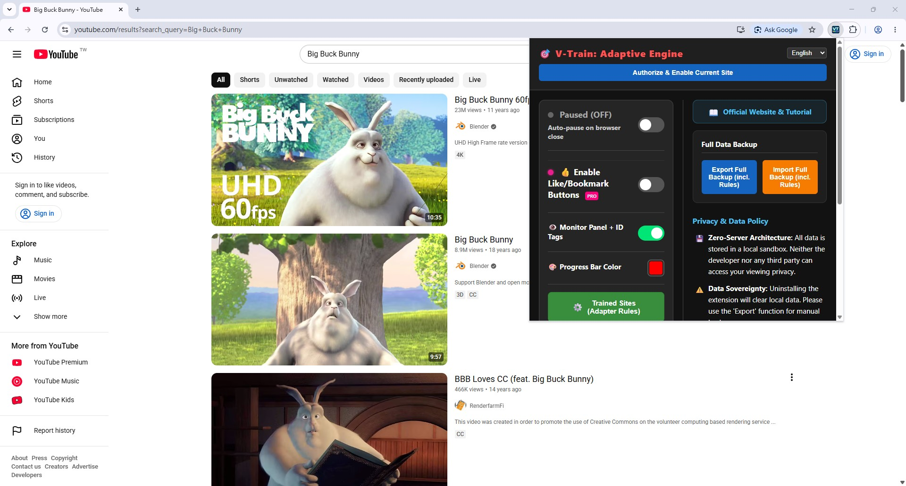
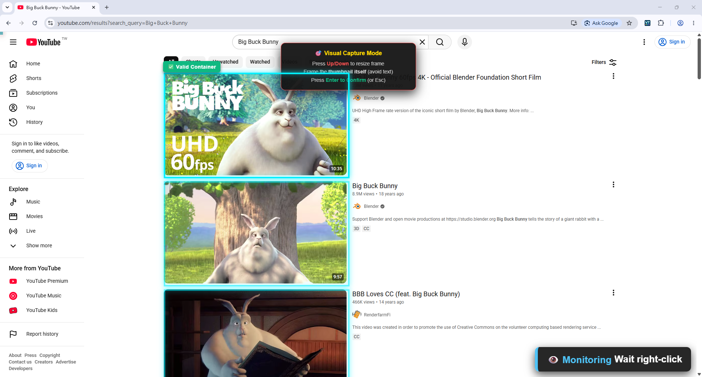
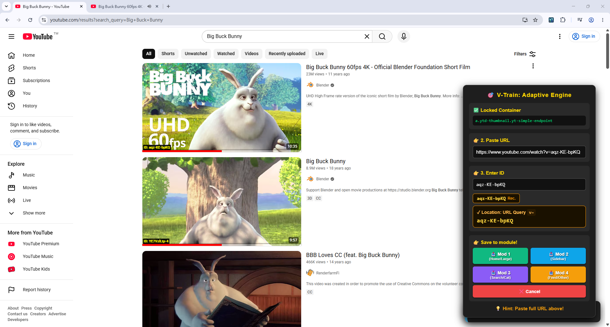
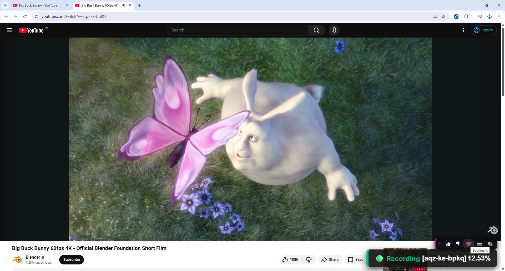
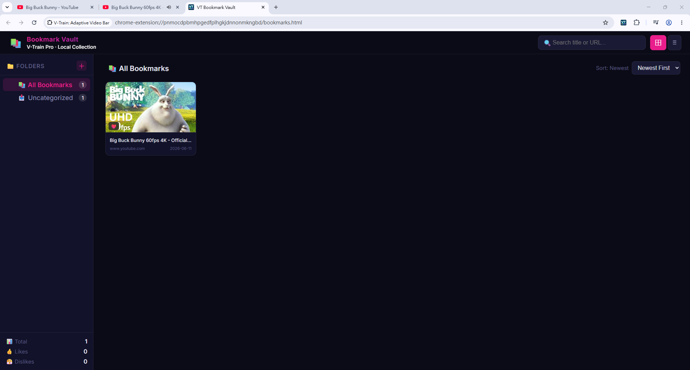
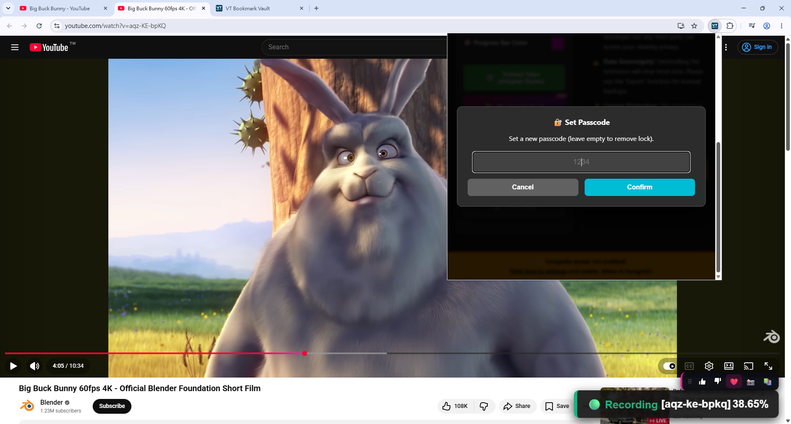

  
  <h1>V-Train (VT) Smart Video Bookmarks & Progress Tracker</h1>
  
A powerful and lightweight Chrome extension designed to elevate your web video browsing experience.

  
  
  
  
   
  
<b>🌍 Languages:</b> <a href="README.md">繁體中文</a> | English

---

## 📖 Table of Contents
1. [Core Features](#core-features)
2. [Installation](#installation)
3. [Quick Start](#quick-start)
4. [PRO Features](#pro-features)
5. [Architecture Highlights](#architecture)
6. [License](#license)

---

## ✨ Core Features

* **🎥 Non-intrusive Progress Tracking**: Intelligently analyzes video player pages, records exact playback progress, and automatically overlays a progress bar on video thumbnails.
* **🤖 Dynamic URL Parser (Training Mode)**: A powerful rule engine that allows users to manually select thumbnails. The extension automatically learns and creates custom parsing rules for that specific website.
* **❤️ Video Bookmarks & Hover Panel (PRO)**: Hover over any video thumbnail to reveal a sleek operations panel. Supports "Like/Dislike" ratings, one-click bookmarking, and custom folder management.
* **📸 Built-in Thumbnail Caching**: Bypasses CDN hotlinking restrictions by capturing the current video frame as a custom cover with a single click, caching the binary image directly to the local database.

---

## 🚀 Installation

### Method 1: Chrome Web Store (Recommended)
The easiest way with automatic updates.
1. Go to the [Chrome Web Store](https://chromewebstore.google.com/detail/v-train-adaptive-video-ba/cikabjkegiefjgalfncfoehmkpmkoiaf).
2. Click **"Add to Chrome"**.

### Method 2: Manual Installation (Developer Mode)
If you want to install the latest dev build or modify the code yourself:
1. `Clone` or `Download ZIP` this repository and extract it to your computer.
2. Open Chrome and navigate to `chrome://extensions/`.
3. Enable **"Developer mode"** in the top right corner.
4. Click **"Load unpacked"** and select the extracted folder.

---

## 📚 Quick Start

> [!TIP]
> Here are the core features of V-Train to help you get started quickly!

### 1. Control Panel
A complete dashboard that allows you to toggle features, customize progress bar colors, and backup/restore all your custom rules and bookmark histories.

  

### 2. Adaptive Training Engine
Encounter a website that isn't automatically tracked? You can teach V-Train to recognize it!
Right-click on a video thumbnail and select `V-Train: Start Training Engine`. Use the Up/Down arrow keys to adjust the blue selection box, and press Enter to lock the target.

  

Next, the system will automatically extract and parse the URL. If the system fails to capture it perfectly, you can **manually edit the field** to help VT find the correct Video ID. Once confirmed, save it to the corresponding module, and the system will permanently remember the progress bar rules for that website!

  

---

## 👑 PRO Features

V-Train offers a one-time purchase PRO version, providing heavy users and privacy-conscious players with greater control and an enhanced bookmarking experience:

### 1. Hover Operations Panel
When watching videos on supported sites, a beautiful operations panel automatically appears in the bottom right corner.
It includes progress tracking status (Recording), one-click bookmarking, ratings, and a quick screenshot tool.

  

### 2. Bookmark Vault
Click the extension icon or the "Bookmark Vault" button on the hover panel to enter your personal video library.
Supports folder categorization, chronological sorting, and an excellent dark mode visual experience.

  

### 3. Passcode Protection
Your viewing privacy is paramount. The PRO version allows you to set a custom passcode. Anyone attempting to open the **Extension Control Panel** must pass verification first, completely protecting your settings and vault from prying eyes.

  

---

## 🛠️ Architecture Highlights

* **Perfect Manifest V3 Support**: Fully compliant with Google's latest security guidelines.
* **Hybrid IndexedDB Storage**: Combines `chrome.storage.local` with `IndexedDB` to ensure smooth reading and writing of massive video data.
* **Performance Optimization**: Heavily utilizes `requestAnimationFrame` for batch DOM reads/writes to prevent Layout Thrashing; uses a `Promise` Lock mechanism to ensure asynchronous writes do not conflict.

## 📜 License
This project is licensed under the [MIT License](LICENSE).
